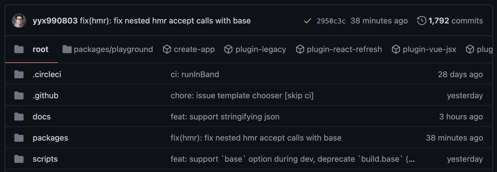
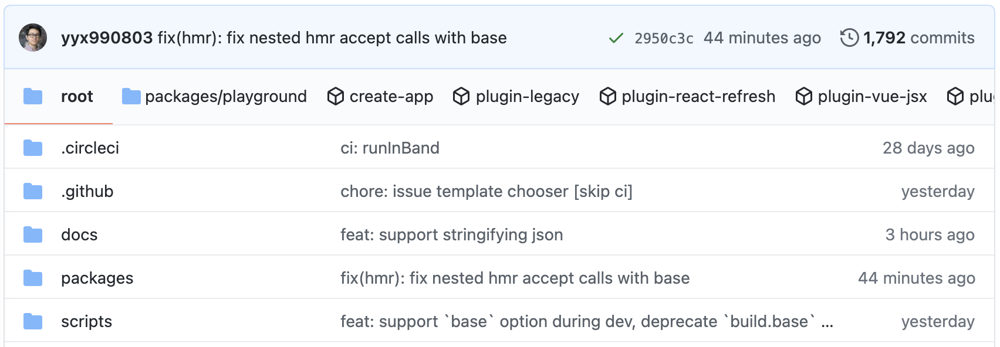

# GitHub Monorepo Navbar

### Adds a navbar with buttons for each package in a monorepo

Short video example: https://www.youtube.com/watch?v=BjnUreKyqCs

### Extension install

**Chrome:** https://chrome.google.com/webstore/detail/github-monorepo-navbar/iigikckkdgebggplbllmlmkdafemmcej

**Firefox:** https://addons.mozilla.org/en-US/firefox/addon/github-monorepo-navbar

---

Pretty simple and minimal browser extension that parses a `lerna.json` or `package.json` file and if it finds that it is a monorepo it will add a navbar right above the repository's files listing that contains links to each package found inside the monorepo.

Uses the same icons and colors as GitHub, so it doesn't look out of place on the page. Also still supports GitHub's dark and light modes.

It works by requesting the content of (lerna/package).json and extracting the paths to the monorepo's directories. Then uses the GitHub API to request the content of those directories and adds links to those into the navbar.

It of course caches each repository's monorepo info, so you won't be sending requests to GitHub's API every reload. It caches based on the most recent commit timestamp, so it only ever checks for the above stuff after a new commit.

---

### Screenshots:

|         Dark mode         |             Light mode              |
| :-----------------------: | :---------------------------------: |
|  |  |
